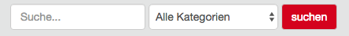
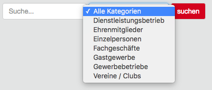

# Ext: Femanager extended search

## What does it do?
Add and select box with frontend user groups to filter the frontend user by their group.

## Installation / Configuration
Download the extension from github and upload it via ftp or use a composer based installation.

#### Installation with Composer

Install the extension in your (Composer)[1] based TYPO3 project root with

    composer require chriwo/femanager_extended_search

#### Installation as extension from TYPO3 Extension Repository (TER)

Download and install the extension with the extension manager module.

#### Configuration
Add the static TypoScript `Femanager extended search`.

In the TypoScript setup is it possible to exclude frontend user groups from select box. See the code snippet below and add
frontend user groups ID as comma separated list to exclude them.

    plugin.tx_femanager {
        settings {
            list {
                filter {
                    searchgroup {
                        removeFromUserGroupSelection =
                    }
                }
            }
        }
    }

[1]: https://getcomposer.org/